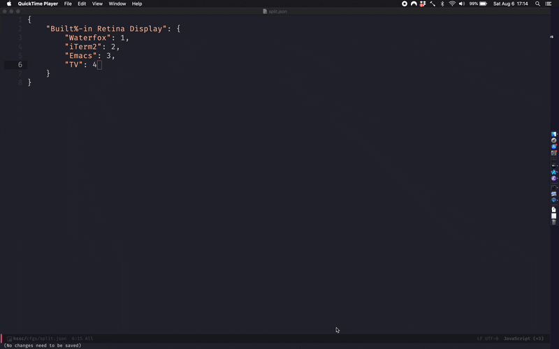

# hssc

A simple Hammerscript script I wrote to manage application windows on different spaces/displays.



## Installation

`hs` needs to be available in your $PATH. To install, open the Hammerspoon console and run `hs.spaces.cliInstall()`.
You could also add this to your `~/.hammerspoon/init.lua` so that it automatically executes when Hammerspoon starts.

## Configuration

To get the names of all monitors (screens), you can open the `hs` interpreter and write:

```
hs.screen.allScreens()
```

This will return a table. Because I am writing this on my laptop with no external display, it will only
contain one element:

```
> hs.screen.allScreens()[1]
hs.screen: Built-in Retina Display (0x60000035f178)
```

This means we identify this screen with the string "Built-in Retina Display". 

My most basic config, `cfgs/mb13-basic.json` looks like so:

```
{
    "Built%-in Retina Display": {
	"Waterfox": 1,
	"iTerm2": 2,
	"Emacs": 3
    }
}
```

This is a dictionary of dictionaries. The outer dictionary maps the screen name (my retina display)
to an internal dictionary which maps the application name to the screen index it should be in. Note
that for Lua indices are one-indexed, so this means: assign Waterfox/iTerm2/Emacs to Desktops 1,2,3
respectively on Mission Control. If not enough spaces exist to make this possible, the script will
internally add more to try and make this possible. If the application cannot be found (i.e. it isn't
currently open), it will be skipped.

Note the escape character in "Built%-in Retina Display" since hyphens need to be escaped with "%".
You can also assign the same index to more than one app, e.g. Waterfox and iTerm can both be assigned
index 1. If you're using this in combination with a tiling window manager like Yabai then this feature
should be helpful.
